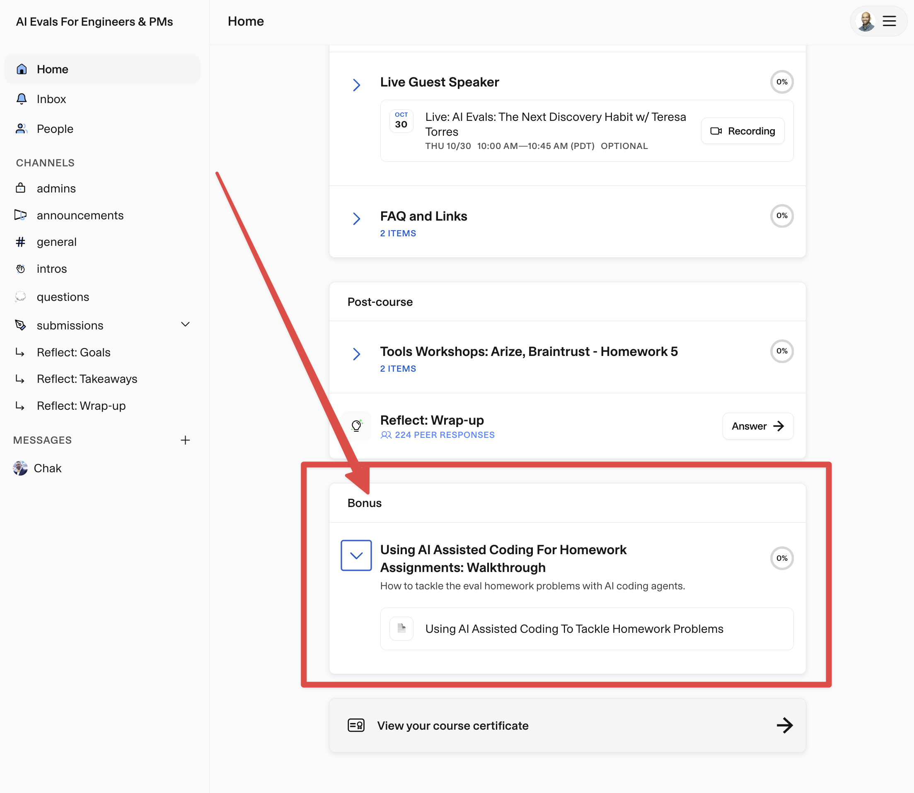

# Recipe Chatbot - AI Evaluations Course

This repository contains a complete AI evaluations course built around a Recipe Chatbot. Through 5 progressive homework assignments, you'll learn practical techniques for evaluating and improving AI systems.

## Quick Start

1. **Clone & Setup**
   ```bash
   git clone https://github.com/ai-evals-course/recipe-chatbot.git
   cd recipe-chatbot
   uv sync
   source .venv/bin/activate
   ```

2. **Configure Environment**
   ```bash
   cp env.example .env
   # Edit .env to add your model and API keys
   ```

3. **Run the Chatbot**
   ```bash
   uv run uvicorn backend.main:app --reload --reload-include '*.md'
   # Open http://127.0.0.1:8000
   ```

## Course Overview

**Bonus**: [Using AI Assisted Coding to Tackle Homework Problems](https://link.courses.maven.com/c/eJw80M2upCAQBeCngZ0Gil8XLGbja5gCymkTbAyoyX37id2Tu6rUl7OoOqm-ajuXLQeQk554qlfr9OxST8rxHHQWMhpOQTrrrFIgNacdt7Kkgr2H2CrmhP38r-fPQYHerZZCmdP7Xr5-XVsOR6t5hKSzIXKDB2MHnQwNHiQMWhIJQ-C9Q_4K3mmbY1zRC_LZw-Scw9XHKCe_Kot8CyDACimMdFIpNRpjwGaX_JogSeuZFt9_-rjjTe8x1Z1vfVlb3ZePhBlLJ17C6zyPztQfBjOD-TfNYD6wFXwnGgrGzmCmG8szQYAZFIO5_5SC8Xpsr_kq9El5J4ziLWwdMY1rwfPFtPj7VPE54w7wLwAA__8a93gB)



### Homework Progression

1. **HW1: Basic Prompt Engineering** (`homeworks/hw1/`)
   - Write system prompts and expand test queries
   - Walkthrough: See HW2 walkthrough for HW1 content

2. **HW2: Error Analysis & Failure Taxonomy** (`homeworks/hw2/`)
   - Systematic error analysis and failure mode identification
   - **Interactive Walkthrough**:
      - Code: `homeworks/hw2/hw2_walkthrough.ipynb`
      - [video 1](https://youtu.be/h9oAAAYnGx4): walkthrough of code
      - [video 2](https://youtu.be/AKg27L4E0M8): open & axial coding walkthrough

3. **HW3: LLM-as-Judge Evaluation** (`homeworks/hw3/`)
   - Automated evaluation using the `judgy` library
   - **Interactive Walkthrough**:
      - Code: `homeworks/hw3/hw3_walkthrough.ipynb`
      - [video](https://youtu.be/1d5aNfslwHg): walkthrough of solution

4. **HW4: RAG/Retrieval Evaluation** (`homeworks/hw4/`)
   - BM25 retrieval system with synthetic query generation
   - **Interactive Walkthrough**: 
     - Code: `homeworks/hw4/hw4_walkthrough.ipynb`
     - [video](https://youtu.be/GMShL5iC8aY): walkthrough of solution

5. **HW5: Agent Failure Analysis** (`homeworks/hw5/`)
   - Analyze conversation traces and failure patterns
   - **Interactive Walkthrough**:
      - Code: `homeworks/hw5/hw5_walkthrough.ipynb`
      - [video](https://youtu.be/z1oISsDUKLA): walkthrough of solution 

### Key Features

- **Backend**: FastAPI with LiteLLM (multi-provider LLM support)
- **Frontend**: Simple chat interface with conversation history
- **Annotation Tool**: FastHTML-based interface for manual evaluation (`annotation/`)
- **Retrieval**: BM25-based recipe search (`backend/retrieval.py`)
- **Query Rewriting**: LLM-powered query optimization (`backend/query_rewrite_agent.py`)
- **Evaluation Tools**: Automated metrics, bias correction, and analysis scripts

## Project Structure

```
recipe-chatbot/
├── backend/               # FastAPI app & core logic
├── frontend/              # Chat UI (HTML/CSS/JS)
├── homeworks/             # 5 progressive assignments
│   ├── hw1/              # Prompt engineering
│   ├── hw2/              # Error analysis (with walkthrough)
│   ├── hw3/              # LLM-as-Judge (with walkthrough)
│   ├── hw4/              # Retrieval eval (with walkthroughs)
│   └── hw5/              # Agent analysis
├── annotation/            # Manual annotation tools
├── scripts/               # Utility scripts
├── data/                  # Datasets and queries
└── results/               # Evaluation outputs
```

## Running Homework Walkthroughs

Each homework (HW2-HW5) includes a self-contained Jupyter notebook walkthrough:

```bash
cd homeworks/hw2
jupyter notebook hw2_walkthrough.ipynb
```

The walkthroughs use data from `reference_files/` and can be run without any external scripts. Each notebook includes:
- Data loading and exploration
- Step-by-step solution code
- Expected outputs and analysis

## Additional Resources

- **Annotation Interface**: Run `python annotation/annotation.py` for manual evaluation
- **Bulk Testing**: Use `python scripts/bulk_test.py` to test multiple queries
- **Trace Analysis**: All conversations saved as JSON for analysis

## Environment Variables

Configure your `.env` file with:
- `MODEL_NAME`: LLM model for chatbot (e.g., `openai/gpt-5-chat-latest`, `anthropic/claude-3-sonnet-20240229`)
- `MODEL_NAME_JUDGE`: LLM model for judge, which can be smaller than the chatbot model (e.g., `openai/gpt-5-mini`, `anthropic/claude-3-haiku-20240307`)
- API keys: `OPENAI_API_KEY`, `ANTHROPIC_API_KEY`, etc.

See [LiteLLM docs](https://docs.litellm.ai/docs/providers) for supported providers.

## Course Philosophy

This course emphasizes:
- **Practical experience** over theory
- **Systematic evaluation** over "vibes"
- **Progressive complexity** - each homework builds on previous work
- **Industry-standard techniques** for real-world AI evaluation
