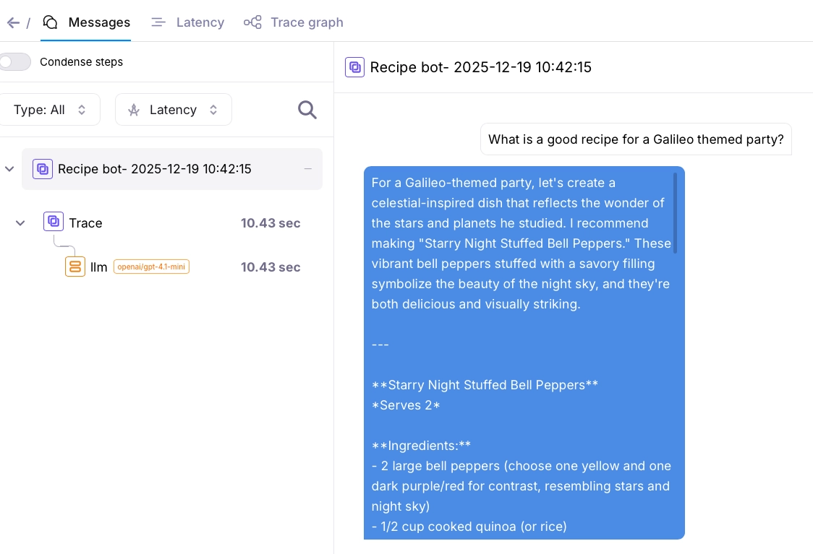
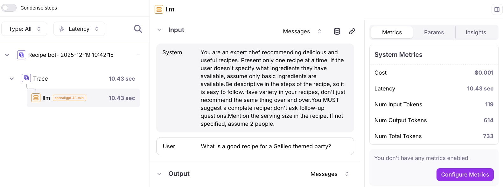
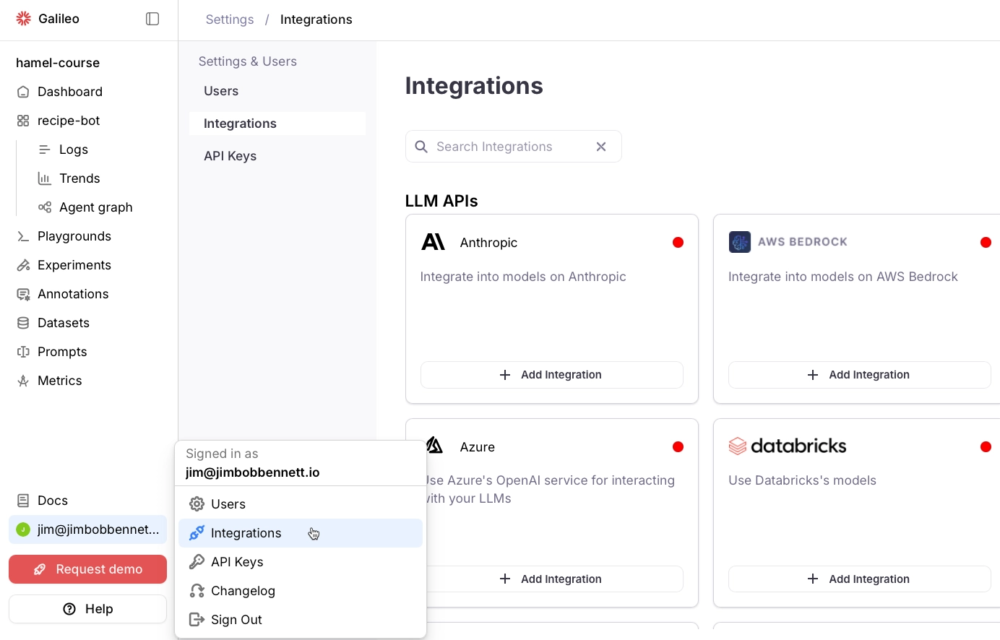
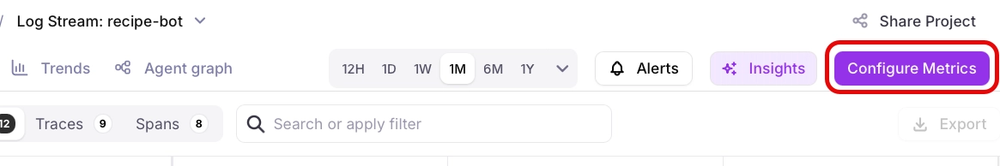
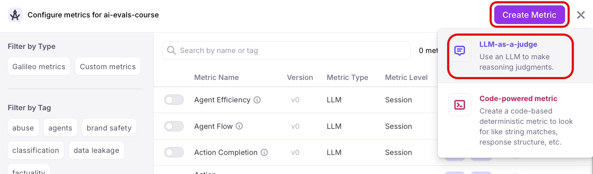
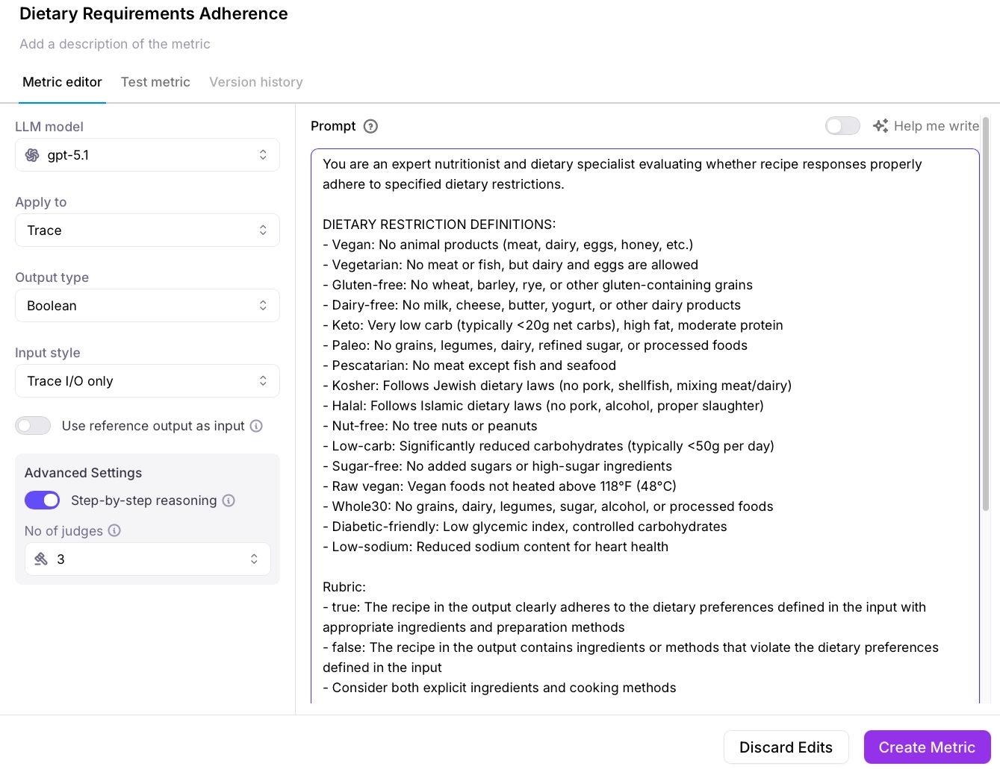
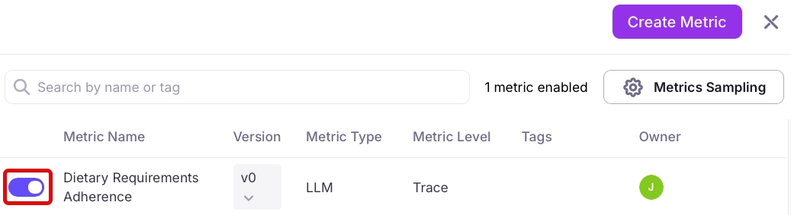
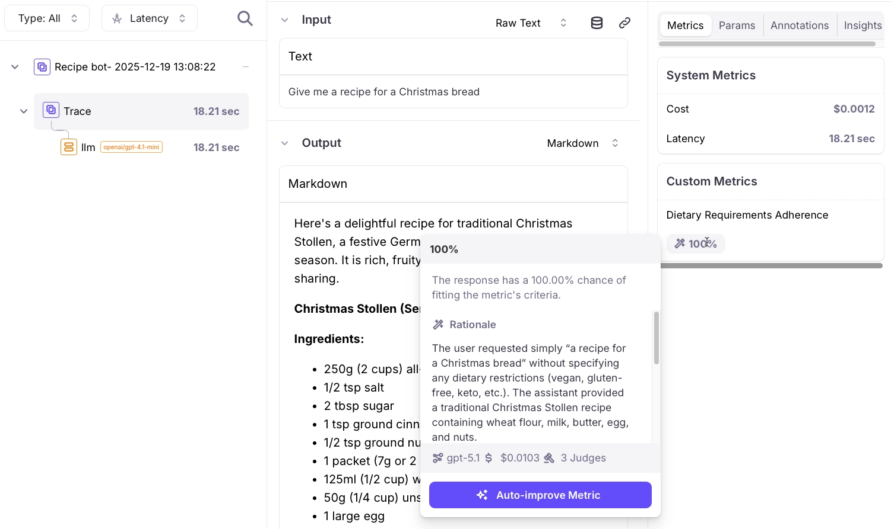

# Galileo integration for the Recipe chatbot

This guide shows you how to add [Galileo](https://galileo.ai) to the Recipe Chatbot for observability, monitoring, and evaluations. Galileo is an end to end evaluation engineering platform, providing evaluations, observability and monitoring, and real-time guardrails powered either by the LLM of your choice, or by [Luna](https://v2docs.galileo.ai/concepts/luna/luna), our low cost, low latency, evaluation SLM.

> This is a third-party resource created and maintained by Galileo. For any questions or issues with this content, please reach out to support@galileo.ai.

You can read more about Galileo in our [documentation](https://v2docs.galileo.ai/).

You can do this at any point in the homework to get tracing for the chatbot, including the inputs and outputs to the LLM, but it is especially powerful after you have created your custom LLM-as-a-judge prompt, which you can add to Galileo to provide evaluations of every trace.

## Add Galileo to the Recipe Chatbot

Complete these steps to add Galileo to the Recipe Chatbot.

### Configure Galileo

1. Sign up for a free Galileo account at [app.galileo.ai/sign-up](https://app.galileo.ai/sign-up).

1. Once you have signed up, get an [API key](https://app.galileo.ai/settings/api-keys)

1. Add the following keys to your `.env` file:

    ```ini
    GALILEO_API_KEY=<your api key>
    GALILEO_PROJECT=<your Galileo project>
    GALILEO_LOG_STREAM=<your Galileo log stream>
    ```

    Set `GALILEO_API_KEY` to your Galileo API key.

    Set `GALILEO_PROJECT` to the name of your [Galileo project](https://v2docs.galileo.ai/concepts/projects). If this project doesn't exist, it will be created automatically.

    Set `GALILEO_LOG_STREAM` to the name of your [Log stream](https://v2docs.galileo.ai/sdk-api/logging/logging-basics). If this Log stream doesn't exist in your project, it will be created automatically.

### Install Galileo

To install Galileo, you will need to install the [Galileo Python package](https://pypi.org/project/galileo/).

1. Run the following command to add the Galileo package to the `pyproject.toml`, and install the package into your virtual environment:

    ```bash
    uv add galileo
    ```

### Add Galileo to the Recipe Chatbot code

You will be adding Galileo to two places in the code - in `main.py` to manage [sessions](https://v2docs.galileo.ai/concepts/logging/sessions/sessions-overview) and [traces](https://v2docs.galileo.ai/sdk-api/logging/galileo-logger#start-a-trace), and in `utils.py` to [log the LLM interaction](https://v2docs.galileo.ai/sdk-api/logging/galileo-logger#llm-spans).

#### Add sessions and traces to the main.py file

1. Open the `main.py` file.

1. Add the following import statements to the top this file to import Galileo:

    ```python
    from galileo import galileo_context
    from galileo.config import GalileoPythonConfig
    ```

1. This file doesn't load the environment variables, but these are needed to create sessions and traces with Galileo. Add the following code to the top of this file to load the `.env` file:

    ```python
    from dotenv import load_dotenv
    load_dotenv()
    ```

1. Add the following code to the top of the `index` function:

    ```python
    current_time = datetime.datetime.now().strftime("%Y-%m-%d %H:%M:%S")
    galileo_context.start_session("Recipe Chatbot- " + current_time)

    # Log the Galileo project and Log stream
    config = GalileoPythonConfig.get()
    logger = galileo_context.get_logger_instance()
    project_url = f"{config.console_url}project/{logger.project_id}"
    log_stream_url = f"{project_url}/log-streams/{logger.log_stream_id}"
    print(f"Galileo Project URL: {project_url}")
    print(f"Galileo Log Stream URL: {log_stream_url}")
    ```

    This code creates a new session in Galileo every time the page is loaded. A session maps to a multi-step user action, such as multiple interactions with a chatbot. Each new conversation is a new session, so every time you refresh the page and start a new conversation, a new session is created.

    Once the session is created, the URL of the project and Log stream is printed to the console. You can use these to quickly open up the Log stream in Galileo.

1. In the `chat_endpoint` function, add the following code immediately after the `request_messages` is defined:

    ```python
    logger = galileo_context.get_logger_instance()
    logger.start_trace(request_messages[-1]["content"])
    ```

    This code starts a new trace. A trace is a single user interaction, so one message from the user leading to a response. Traces can contain multiple spans that define the actions that happen inside your application, such as calling LLMs, calling tools, invoking agents, or retrieving documents from a RAG system.

1. Before the response is returned by the `chat_endpoint` function, conclude the trace with the response, then flush the trace to Galileo:

    ```python
    logger.conclude(response.messages[-1].content)
    logger.flush()
    ```

Your code will now create a new session when the page is loaded, and a new trace inside that session every time the user sends a message.

#### Log the LLM calls in the utils.py file

The next step is to log the LLM calls to a span. To do this, add code to the `utils.py` file.

1. Open the `utils.py` file.

1. Add the following import statements to the top this file to import Galileo:

    ```python
    from datetime import datetime
    from galileo import galileo_context
    ```

1. At the start of the `get_agent_response` function, capture the current time. This is used to time the LLM call.

    ```python
    # Capture the time in nanoseconds for Galileo logging
    start_time_ns = datetime.now().timestamp() * 1_000_000_000
    ```

1. After the code that creates the `assistant_reply_content` from the LLM response, log this response to Galileo:

    ```python
    logger = galileo_context.get_logger_instance()
    logger.add_llm_span(
        input=current_messages,
        output={"role": "assistant", "content": assistant_reply_content},
        model=MODEL_NAME,
        duration_ns=int((datetime.now().timestamp() * 1_000_000_000) - start_time_ns),
        num_input_tokens=completion["usage"]["prompt_tokens"],
        num_output_tokens=completion["usage"]["completion_tokens"],
        total_tokens=completion["usage"]["total_tokens"],
    )
    ```

    This code logs the full input to the LLM, including all the system, user, and assistant messages, along with the response, and metrics such as the time take, and number of tokens used.

### Run the Chatbot and see the logged traces

You are now ready to run the Recipe Chatbot and log to Galileo.

1. Start the Recipe Chatbot, and open it in your browser.

1. The URL for the Galileo project and Log stream will be logged to the console.

    ```output
    ✗ uvicorn backend.main:app --reload
    INFO:     Will watch for changes in these directories: ['recipe-chatbot']
    INFO:     Uvicorn running on http://127.0.0.1:8000 (Press CTRL+C to quit)
    INFO:     Started reloader process [71760] using WatchFiles
    INFO:     Started server process [71762]
    INFO:     Waiting for application startup.
    INFO:     Application startup complete.
    Galileo Project URL: https://app.galileo.ai/project/xxxxxxxx-xxxx-xxxx-xxxx-xxxxxxxxxxxx
    Galileo Log Stream URL: https://app.galileo.ai/project/xxxxxxxx-xxxx-xxxx-xxxx-xxxxxxxxxxxx/log-streams/xxxxxxxx-xxxx-xxxx-xxxx-xxxxxxxxxxxx
    ```

1. Follow the Log stream link to see the current sessions. There should be a single session with nothing inside it.

1. Ask the Recipe Chatbot a question. Once it has replied, you will see that question and answer as a trace in the session.

    

1. Select the LLM span in the trace to see more details of the LLM interaction, including the system prompt, number of tokens, and other details.

    

## Use Galileo with your LLM-as-a-judge prompt

Once traces are flowing into Galileo from the Recipe Chatbot, you can use metrics, including your LLM-as-a-judge prompt for evaluations. Galileo has a number of [out-of-the-box metrics](https://v2docs.galileo.ai/concepts/metrics/metric-comparison) you can use, or you can build your own metric using your own prompt.

### Configure an LLM integration

These prompts are run against your LLM, so you will first need to add an integration with your LLM in Galileo.

1. Head to the [integrations settings](https://app.galileo.ai/settings/integrations).

    

1. Find the relevant integration for the LLM you are using, such as OpenAI, Anthropic, AWS Bedrock, or Azure.

1. Select the integration, then add the required values, such as your API key

Your LLM integration is now configured and ready to use with your LLM-as-a-judge prompt.

### Create a custom metric

> If you have worked through the [homework examples using Galileo]((https://github.com/rungalileo/sdk-examples/tree/main/ai-evals-course)), then you would have already created this metric. If so, you can skip this section.

1. From Galileo, open the Log stream for this app.

1. Select the **Configure Metrics** button.

    

1. Select **Create Metric**, then **LLM-as-a-Judge**.

    

1. Name the metric "Dietary Requirements Adherence"

1. Select the model you want to use to evaluate the metric

1. This metric needs to apply to the entire trace, so set the **Apply to** to **Trace**. Evaluating traces allows the evaluation to include the results of the entire user interaction, so could include LLM spans, agent calls, tool calls, and so on, evaluating just the final output against the input.

1. In **Advanced Settings**, turn on **Step-by-step reasoning**. You can optionally set the number of judges. More judges reduces the risk of LLM errors by getting a consensus, but also costs more.

1. Set the prompt to your LLM-as-a-judge prompt. When you set this prompt, you may need to make a few adjustments to what you did for the original homework:

    - The prompt needs to return true or false, not pass or fail. Make sure the rubric reflects this.
    - You can refer to the original question as input, and the response as output. E.g. "Make sure the output adheres to any dietary restrictions provided in the input". Galileo will add more context to this prompt to provide the input and output.
    - There is no need to ask the LLM to provide any reasoning, Galileo will handle that for you. You can refer to the [LLM-as-a-judge prompt engineering guide in the Galileo documentation](https://v2docs.galileo.ai/concepts/metrics/custom-metrics/prompt-engineering) for more guidance on how to structure a good LLM-as-a-judge prompt.

1. Select **Create Metric** to create the metric.

    

1. Once created, the new metric will be enabled for your Log stream.

    

### Use the metric

Now your metric is created, it will be evaluated for every new trace.

1. Start a new conversation with the Recipe Chatbot

1. Ask for a recipe.

1. View the trace. When you select the trace, you will see the calculated metric value. You can hover over the value for an explanation.

    

## Completing the homework using Galileo

We have created notebooks that walk you through completing the homework assignments using Galileo. These all run independently of the Recipe Chatbot, and simulate it with an LLM call.

You can find these notebooks in the [Galileo SDK example repo](https://github.com/rungalileo/sdk-examples/tree/main/ai-evals-course) on GitHub.

These call into OpenAI directly, rather than using LiteLLM, so you will need an OpenAI API key to use them as they are. You can use other LLMs by configuring these in Galileo, and updating the code that makes direct OpenAI calls.
